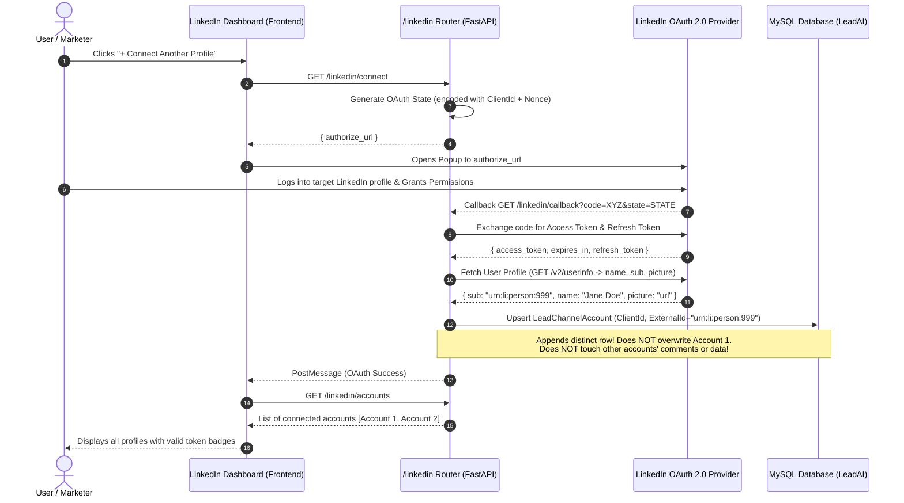
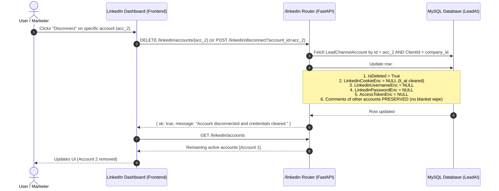
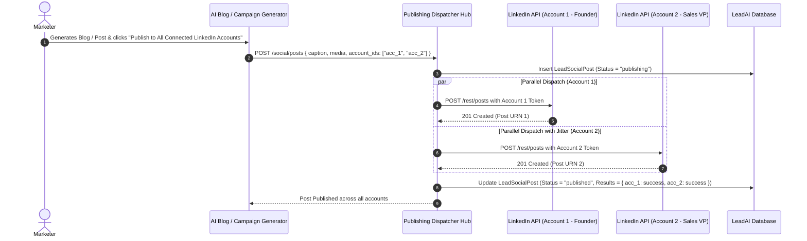

# LeadAI • LinkedIn Multi-Account Connection & Publishing Architecture Plan

## 1. Executive Summary & Core Requirements

In business outreach, recruitment, and B2B marketing, a single company operating on **LeadAI** frequently needs to publish content, announcements, and thought-leadership articles across **multiple team members' LinkedIn accounts** (e.g., Founder, VP Sales, Talent Lead) and **Company Pages** simultaneously.

### 1.1 Strict Project Guardrails
1. **Official LinkedIn OAuth for Multi-Account Posting**:
   * Multi-account connection, token management, and parallel publishing use **official LinkedIn OAuth 2.0** (`access_token`, `refresh_token`, OpenID `userinfo`, and LinkedIn REST `/rest/posts` / `/v2/ugcPosts` APIs).
2. **Playwright Bot Functions Untouched**:
   * Existing Playwright / browser automation functions in `Backend/LeadAI/social/linkedin_bot.py` (Voyager browser emulation, candidate searches, invitations) **will NOT be modified or broken**. They remain completely intact.
3. **Preserve Comments & Data (Zero Blanket Wiping)**:
   * Connecting a new LinkedIn account or refreshing tokens will **NEVER** wipe or soft-delete comments, leads, or messages from other connected accounts or the company.
4. **Guaranteed `li_at` Cookie Clearing on Disconnect**:
   * When any LinkedIn account is disconnected (via `POST /linkedin/disconnect`, `DELETE /linkedin/credentials`, or `DELETE /linkedin/accounts/{account_id}`), the personal session cookie `li_at` (`LinkedinCookieEnc`), username, password, and tokens must be **completely wiped (`None`)** for that account row.
5. **Two-Stage Rollout Strategy**:
   * **Target 1 (Immediate Priority)**: Connect multiple LinkedIn accounts with official tokens, verify and list all connected profiles with valid tokens in the UI/backend, and ensure clean disconnect/cleanup.
   * **Target 2 (Follow-up Phase)**: AI Blog/Campaign Generator parallel fan-out to publish generated blogs across all connected accounts concurrently.

---

## 2. Current Architecture vs. Required Evolution

### 2.1 Current System Bottlenecks & Code Audit

| Layer | File / Location | Current Limitation | Required Evolution |
| :--- | :--- | :--- | :--- |
| **Channel Guard** | `Backend/LeadAI/routers/channels.py`<br>`_assert_no_competing_account_for_company` (L130-146) | Throws `409 Conflict` if a second account for the channel already exists for the company. | Exempt `linkedin` (or allow `MULTI_ACCOUNT_CHANNELS = {"linkedin"}`) while enforcing uniqueness per `(Channel, ExternalId)` globally. |
| **OAuth Save** | `Backend/LeadAI/social/linkedin.py`<br>`save_tokens` (L168-186 & L223-232) | Rejects connection if another LinkedIn account is connected (`"This company already has a LinkedIn account connected..."`). Soft-deletes comments across the entire client (L225). | Allow appending new `LeadChannelAccount` rows with distinct `ExternalId`s. **Remove the comment soft-delete** so existing comments are preserved. |
| **Token Retrieval** | `Backend/LeadAI/social/linkedin.py`<br>`get_valid_access_token` (L237-274) | Takes only `(db, client_id)` and executes `.first()`. | Accept `(db, client_id, account_id=None)`. If `account_id` is supplied, resolve that specific account; if omitted, return primary or fail gracefully. |
| **Disconnect & Cookie Cleanup** | `Backend/LeadAI/routers/linkedin.py`<br>`linkedin_disconnect` & `disconnect_linkedin_credentials` (L160-176, L480-496) | Only disconnects `.first()`. Wipes all company comments. | Support `account_id`. Clear `LinkedinCookieEnc = None` (`li_at`), `LinkedinUsernameEnc = None`, `LinkedinPasswordEnc = None`, `AccessTokenEnc = None`. Do **not** wipe other accounts' comments. |
| **Account Discovery** | `Backend/LeadAI/routers/linkedin.py`<br>`linkedin_status` (L81-139) | Returns only single status for `.first()`. | Add `GET /linkedin/accounts` returning list of all connected profiles (Name, Avatar, URN, Token Expiration, Status). |
| **Frontend LinkedIn Dashboard** | `Frontend/.../features/linkedin/linkedin-dashboard.component.ts` | Single `status: LinkedInStatus \| null`. No account switcher or multi-account list. | Introduce Connected Profiles Grid showing all accounts, individual disconnect, and "+ Connect Another Profile" button. |
| **Publishing Schema** | `Backend/LeadAI/social/schemas.py`<br>`_PlatformsMixin` (L41-56) | Only provides `account_id: str \| None` (singular) and `platforms: list[Platform]`. | (Target 2) Introduce `account_ids: list[str] \| None` to allow targeting multiple specific LinkedIn accounts in one request. |

---

## 3. Architecture & Interaction Diagrams

### 3.1 Target 1: Connecting Multiple LinkedIn Accounts via Official OAuth



---

### 3.2 Target 1: Disconnecting an Account with Guaranteed `li_at` Cleanup



---

### 3.3 Target 2 (Future): AI Blog Generation Parallel Fan-Out



---

## 4. Detailed Specification for Target 1

### 4.1 Backend Changes

#### 1. Relax Single-Account Constraint for LinkedIn
In `Backend/LeadAI/routers/channels.py`:
```python
MULTI_ACCOUNT_CHANNELS = {"linkedin"}

def _assert_no_competing_account_for_company(db: Session, client_id: str, channel: str, external_id: str) -> None:
    if channel in MULTI_ACCOUNT_CHANNELS:
        # Multiple distinct external profiles allowed for LinkedIn
        return
    ...
```

#### 2. Prevent Blanket Comment Wiping & Allow Appending in `save_tokens`
In `Backend/LeadAI/social/linkedin.py` (`save_tokens`):
* Remove lines 168–186 which reject new LinkedIn profiles.
* Remove lines 223–232 which soft-delete all comments across `client_id`.
* Fetch profile name and avatar from LinkedIn OpenID `userinfo` endpoint during token exchange and save:
  * `db_cred.Name = profile_data.get("name") or "LinkedIn Profile"`
  * `db_cred.MetaJson["profile_picture_url"] = profile_data.get("picture")`
  * `db_cred.MetaJson["email"] = profile_data.get("email")`

#### 3. New Endpoint: `GET /api/leadai/linkedin/accounts`
In `Backend/LeadAI/routers/linkedin.py`:
Returns all non-deleted LinkedIn accounts for `client_id`:
```json
{
  "accounts": [
    {
      "id": "uuid-1",
      "name": "Iqbal Hussain",
      "person_urn": "urn:li:person:abc123",
      "profile_picture_url": "https://media.licdn.com/...",
      "token_valid": true,
      "token_expires_at": "2026-11-20T10:00:00Z",
      "has_cookie_credentials": false,
      "is_active": true,
      "created_at": "2026-09-10T12:00:00Z"
    }
  ],
  "total": 1
}
```

#### 4. Disconnect Endpoint with `li_at` Cookie Wiping: `DELETE /api/leadai/linkedin/accounts/{account_id}`
In `Backend/LeadAI/routers/linkedin.py`:
* Accepts optional `account_id` (or path parameter).
* Verifies `assert_owns(account.ClientId, client_id)`.
* Updates target row:
  ```python
  account.IsDeleted = True
  account.LinkedinCookieEnc = None      # Explicitly clear li_at cookie
  account.LinkedinUsernameEnc = None
  account.LinkedinPasswordEnc = None
  account.AccessTokenEnc = None
  account.AppSecretEnc = None
  account.UpdatedAt = utcnow()
  db.commit()
  ```
* Does **NOT** delete comments or data from other accounts.

---

### 4.2 Frontend Changes

#### 1. Update `LinkedinService` (`Frontend/src/app/services/linkedin.service.ts`)
* Add `getAccounts(): Observable<{ accounts: LinkedInAccountItem[]; total: number }>`
* Add `disconnectAccount(accountId: string): Observable<{ ok: boolean }>`

#### 2. Update `LinkedinDashboardComponent` (`Frontend/src/app/features/linkedin/`)
* In **Connection & Bot Auth** tab:
  * Display a **Connected Profiles Card Grid** showing every connected account:
    * Avatar image
    * Full Name & Member URN
    * Connection status tag (`Active`, `Expiring`, `Disconnected`)
    * Individual **"Disconnect"** button (triggers specific account cleanup)
  * Display **"+ Connect Another Profile"** button opening the OAuth popup.
  * When OAuth completes, refresh the accounts list.

---

## 5. Verification Checklist for Target 1

- [ ] **Verify Account 1 Connects**: Authorize first LinkedIn profile; verify row created in DB with valid token, name, and avatar.
- [ ] **Verify Account 2 Connects**: Authorize second LinkedIn profile; verify second row created with distinct `ExternalId` without overwriting Account 1.
- [ ] **Verify Comments/Data Intact**: Existing comments/leads from Account 1 are not wiped.
- [ ] **Verify Accounts List**: `GET /linkedin/accounts` returns both accounts.
- [ ] **Verify Disconnect & `li_at` Cleanup**: Disconnect Account 2; verify `LinkedinCookieEnc = None` and tokens are wiped for Account 2, while Account 1 remains active and connected.

---

## 6. Target 2 Preview: Parallel Blog Generation Fan-Out

Once Target 1 is verified:
1. Update `POST /social/posts` schema to accept `account_ids: list[str]`.
2. When the Blog/Campaign generator creates a post:
   * Provide an "All Connected Accounts" toggle.
   * Send the generated blog caption and media along with `account_ids: [acc_1, acc_2]`.
   * Dispatch concurrently using `asyncio.gather` with anti-burst jitter.
   * Return per-account status to the frontend.
